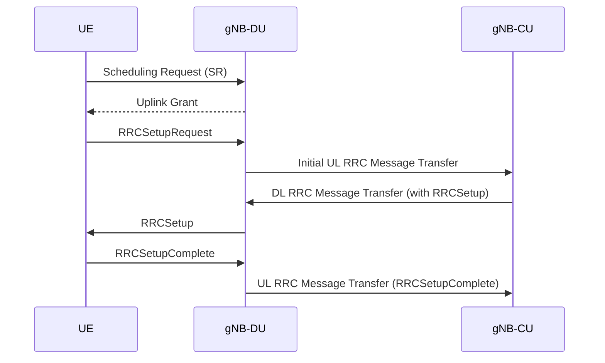

# NR RRC Connection Setup Flow

Start Date: 2025/02/13
Summary: Detailed process of the NR RRC connection setup in 5G, including message transmission, parameters, and sequence flow.
Status: Done
Assign: Ming 咚咚 [銘鴻]
Finish Date: 2025/02/20
SUM: 🗓️ Days Spent to Complete: 7

## **1. Introduction**

In 5G NR, when a User Equipment (UE) needs to send uplink data but has not yet been allocated uplink resources, it transmits a Scheduling Request (SR) to request resources. The following sections outline the detailed process from SR transmission to RRC setup completion, including key message parameters.

---

## **2. UE Scheduling Request (SR) Transmission**

UE sends an SR via the Physical Uplink Control Channel (PUCCH) to request uplink resources. The SR itself does not carry detailed data but merely signals the need for uplink transmission.

---

## **3. Initial UL RRC Message Transfer at DU**

When the UE initiates an RRC connection establishment, it sends an `RRCSetupRequest` message to gNB-DU (Distributed Unit). Upon receiving this request, the gNB-DU encapsulates it within the `Initial UL RRC Message Transfer` and forwards it to gNB-CU (Centralized Unit).

### **Parameters in Initial UL RRC Message Transfer**

| Parameter | Description |
| --- | --- |
| **gNB-DU UE F1AP ID** | Unique identifier for the UE within gNB-DU. |
| **NR CGI** | Global identifier of the NR cell (PLMN Identity + NR Cell Identity). |
| **C-RNTI** | Temporary radio network identifier for the UE. |
| **RRC-Container** | Contains the UE's `RRCSetupRequest` message. |
| **DU to CU RRC Container** | Optional; may contain `CellGroupConfig` including SRB1 configuration. |
| **SUL Access Indication** | Optional; supplementary uplink access indication. |
| **Transaction ID** | Unique transaction identifier. |

```cpp
typedef struct F1AP_InitialULRRCMessageTransferIEs {
	F1AP_ProtocolIE_ID_t	 id;
	F1AP_Criticality_t	 criticality;
	struct F1AP_InitialULRRCMessageTransferIEs__value {
		F1AP_InitialULRRCMessageTransferIEs__value_PR present;
		union F1AP_InitialULRRCMessageTransferIEs__F1AP_value_u {
			F1AP_GNB_DU_UE_F1AP_ID_t	 GNB_DU_UE_F1AP_ID;
			F1AP_NRCGI_t	 NRCGI;
			F1AP_C_RNTI_t	 C_RNTI;
			F1AP_RRCContainer_t	 RRCContainer;
			F1AP_DUtoCURRCContainer_t	 DUtoCURRCContainer;
			F1AP_SULAccessIndication_t	 SULAccessIndication;
			F1AP_TransactionID_t	 TransactionID;
			F1AP_RANUEID_t	 RANUEID;
			F1AP_RRCContainer_RRCSetupComplete_t	 RRCContainer_RRCSetupComplete;
		} choice;
		
		/* Context for parsing across buffer boundaries */
		asn_struct_ctx_t _asn_ctx;
	} value;
	
	/* Context for parsing across buffer boundaries */
	asn_struct_ctx_t _asn_ctx;
} F1AP_InitialULRRCMessageTransferIEs_t;
```

---

## **4. DL RRC Message Transfer at CU**

gNB-CU processes the `Initial UL RRC Message Transfer` and assigns a `gNB-CU UE F1AP ID`. It then generates an `RRCSetup` message and encapsulates it within the `DL RRC Message Transfer`, which is forwarded to gNB-DU for transmission to the UE.

### **Parameters in DL RRC Message Transfer**

| Parameter | Description |
| --- | --- |
| **gNB-CU UE F1AP ID** | Unique identifier assigned by gNB-CU to the UE. |
| **Old gNB-DU UE F1AP ID** | Optional; present in RRC re-establishment scenarios. |
| **RRC-Container** | Contains the `RRCSetup` message. |

---

## **5. RRC Setup Message Contents**

The `RRCSetup` message is sent by the network to the UE for establishing an RRC connection.

### **Parameters in RRC Setup Message**

| Parameter | Description |
| --- | --- |
| **SRB1 Configuration** | Configuration for Signaling Radio Bearer 1 (SRB1). |
| **Physical Layer Configuration** | Configuration parameters for uplink and downlink transmission. |
| **MAC Layer Configuration** | Medium Access Control layer settings. |
| **Measurement Configuration** | Settings for UE measurement and reporting. |
| **Other RRC Parameters** | Additional configurations such as cell reselection and security setup. |

---

## **6. Sequence Diagram**

Below is a sequence diagram describing the entire RRC connection setup process in NR:



---

## **7. Conclusion**

This document provides a comprehensive breakdown of the NR RRC connection setup process, including message structures, parameters, and a sequence flow diagram. Understanding these components is essential for designing and optimizing 5G network operations.