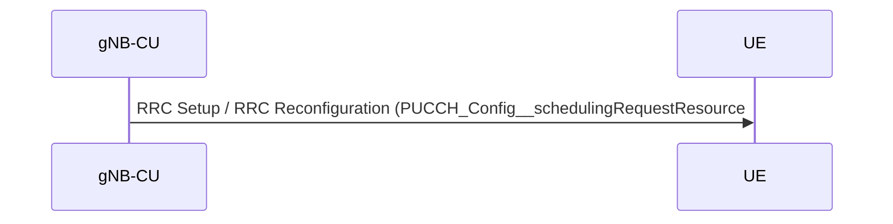
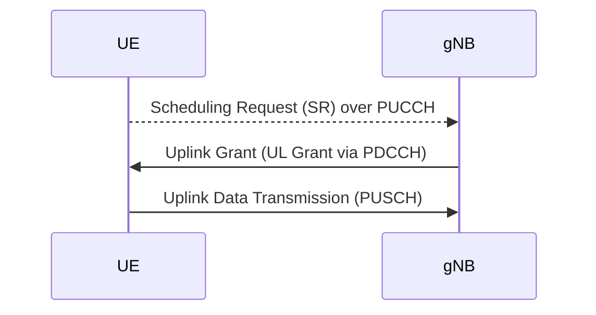

# PUCCH_Config__schedulingRequestResource in 5G NR

Start Date: 2025/02/14
Summary: Configuration and management of uplink resource requests in 5G NR using PUCCH for efficient communication between User Equipment and gNB.
Status: Done
Assign: Ming 咚咚 [銘鴻]
Finish Date: 2025/02/20
SUM: 🗓️ Days Spent to Complete: 6

### **1. Overview**

`PUCCH_Config__schedulingRequestResource` is a configuration parameter in 5G NR (New Radio) that determines how a UE (User Equipment) requests uplink resources using the **Scheduling Request (SR)** mechanism over the **Physical Uplink Control Channel (PUCCH)**. This parameter is essential in defining which PUCCH resources the UE can use for SR transmission.

### **2. Who Prepares and Who Receives?**

- **Prepared by:** **gNB-CU (Centralized Unit)**
- **Sent to:** **UE (User Equipment)** via **RRC Configuration (RRC Setup / RRC Reconfiguration)**

The **gNB-CU** configures `PUCCH_Config__schedulingRequestResource` as part of the RRC (Radio Resource Control) signaling process and sends it to the **UE**. The UE uses this configuration to send SR requests via PUCCH when it needs uplink resources.

---

### **3. Detailed Parameter Breakdown**

The provided structure (`PucchSchedReqCfg`) represents the **PUCCH SR configuration** at the gNB and contains the following key fields:

| **Parameter** | **Type** | **Description** |
| --- | --- | --- |
| `schedAddModListCount` | `uint8_t` | Number of scheduling request resources to be added or modified. |
| `schedAddModList` | `SchedReqResrcInfo[MAX_NUM_SR_CFG_PER_CELL_GRP]` | List of scheduling request resources to be added/modified. |
| `schedRelListCount` | `uint8_t` | Number of scheduling request resources to be released. |
| `schedRelList` | `uint8_t[MAX_NUM_SR_CFG_PER_CELL_GRP]` | List of scheduling request resources to be released. |
- **`schedAddModList`**: Contains the list of scheduling request resources to be added or modified. Each entry provides information about a specific SR resource in PUCCH.
- **`schedRelList`**: Lists the scheduling request resources that should be removed.

---

### **4. Message Flow**

The process of configuring and using `PUCCH_Config__schedulingRequestResource` follows this sequence:

---

### **5. Functional Workflow**

1. **Configuration by gNB-CU**
    - The gNB-CU determines the appropriate SR PUCCH resources based on UE capabilities and network conditions.
    - These configurations are included in the `RRCSetup` or `RRCReconfiguration` message.
    - The `PUCCH_Config__schedulingRequestResource` parameter is part of this message.
2. **Reception & Usage by UE**
    - UE receives the configuration and stores the PUCCH resources allocated for SR.
    - When uplink data is pending and no PUSCH grant is available, UE sends an SR over PUCCH using the configured resource.
3. **SR Reception & UL Resource Allocation by gNB**
    - The gNB monitors PUCCH for SR transmissions.
    - If SR is detected, the gNB schedules an uplink grant via **PDCCH DCI Format 0_0 or 0_1**.
    - The UE then transmits uplink data on PUSCH.

---

### **6. Conclusion**

- `PUCCH_Config__schedulingRequestResource` is configured by **gNB-CU** and sent to the **UE** via **RRC Setup/Reconfiguration**.
- UE uses the configured resources to send **SR** via **PUCCH** when uplink resources are needed.
- The gNB detects SR and grants uplink resources accordingly.