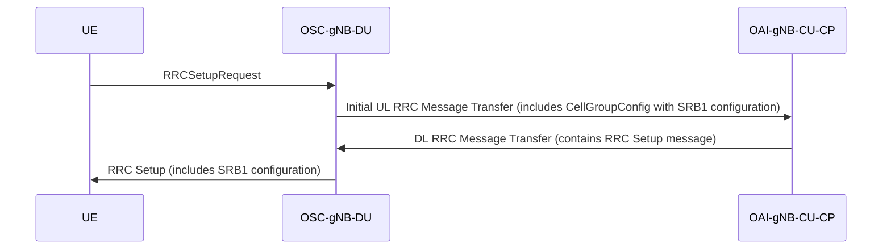

# Understanding the Role of CellGroupConfig in 5G NR UE Access Procedures

Start Date: 2025/02/14
Summary: An analysis of the role of CellGroupConfig in 5G NR User Equipment access procedures, focusing on its function in configuring Signaling Radio Bearer 1.
Status: Done
Assign: Ming 咚咚 [銘鴻]
Finish Date: 2025/02/20
SUM: 🗓️ Days Spent to Complete: 6

[www.etsi.org](https://www.etsi.org/deliver/etsi_ts/138300_138399/138331/18.04.00_60/ts_138331v180400p.pdf)

In 5G New Radio (NR), the `CellGroupConfig` information element (IE) plays a pivotal role during the User Equipment (UE) access procedure, particularly in the configuration of Signaling Radio Bearer 1 (SRB1). This note delves into the contents and transmission direction of `CellGroupConfig`, emphasizing its necessity when the gNB-DU permits UE access.

**Key Points:**

1. **Inclusion of CellGroupConfig:**
    - When the gNB-DU (gNodeB Distributed Unit) allows a UE to access the network, it must include the `CellGroupConfig` IE in its communication to the gNB-CU-CP (gNodeB Central Unit - Control Plane). Notably, this configuration excludes the `ReconfigurationWithSync` information. https://blog.csdn.net/u012800825/article/details/105930850?utm_source=chatgpt.com
2. **Contents of CellGroupConfig:**
    - The `CellGroupConfig` primarily contains the configuration for SRB1. This configuration is essential for establishing the initial signaling connection between the UE and the network.https://blog.csdn.net/u012800825/article/details/105930850?utm_source=chatgpt.com
3. **Transmission Flow:**
    - The gNB-DU sends the `CellGroupConfig` to the gNB-CU-CP. The gNB-CU-CP then incorporates this configuration into the `RRC Setup` message, which is subsequently transmitted to the UE. This process ensures that the UE receives the necessary SRB1 configuration to establish a reliable signaling connection. https://blog.csdn.net/u012800825/article/details/105930850?utm_source=chatgpt.com

**Process Flow Diagram:**

[www.bing.com](https://www.bing.com/ck/a?!&&p=3513c90091578dd2f189f3ebe532ca53435112dfd111610cc1d6ae58507a3b56JmltdHM9MTczOTkyMzIwMA&ptn=3&ver=2&hsh=4&fclid=08fec93d-f737-6e6c-2c76-dcacf6276f14&psq=NR+138.401+spec+v17&u=a1aHR0cHM6Ly93d3cuZXRzaS5vcmcvZGVsaXZlci9ldHNpX3RzLzEzODQwMF8xMzg0OTkvMTM4NDAxLzE2LjAzLjAwXzYwL3RzXzEzODQwMXYxNjAzMDBwLnBkZg&ntb=1)

**Conclusion:**

The `CellGroupConfig` IE is crucial in the 5G NR UE access procedure, particularly for the configuration of SRB1. Its proper transmission from the gNB-DU to the gNB-CU-CP, and subsequently to the UE, ensures the establishment of a reliable signaling connection, facilitating effective communication within the network.